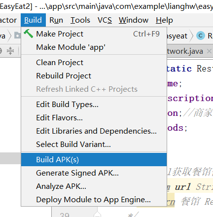

# 安装部署说明
[安卓端app部署文档](#1)

[web前端部署文档](#2)

[后端部署文档](#3)

<h2 id='1'> 安卓端app部署文档 </h2>

# 安卓端app部署文档

- 1.下载源码

  `git clone https://github.com/ssad2019/EE_easyeat_app`
  
- 2.使用Android Studio打开，导出生成apk(目录：\app\build\outputs\apk\debug)

  

<h2 id='2'> web前端部署文档 </h2>

<h2 id='3'> 后端部署文档 </h2>

