### 一. web前端-商家客户端端  
**1**. 打开web客户端所部署域名，本部分使用说明书以localhost：8080为例进行软件功能使用说明，具体部署步骤参考[安装部署说明](https://github.com/ssad2019/Software-Design-Projects/blob/master/%E5%AE%89%E8%A3%85%E9%83%A8%E7%BD%B2%E8%AF%B4%E6%98%8E.md)  
**2**. 首界面-登录界面  
点击register now 可以跳转到注册界面  
  
**3**. 注册界面  
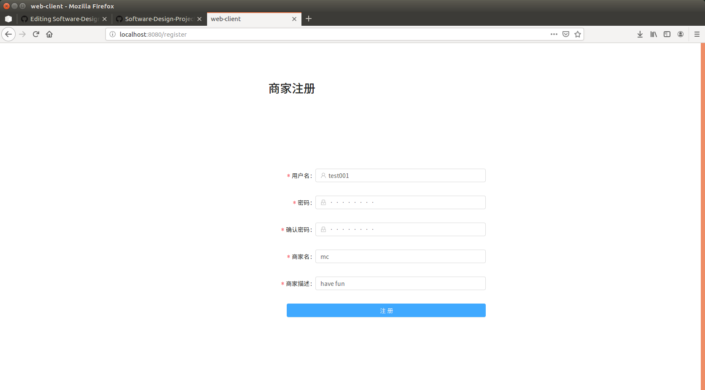 
**4**. 商家商品界面  
+ 使用刚刚注册的账号登录  
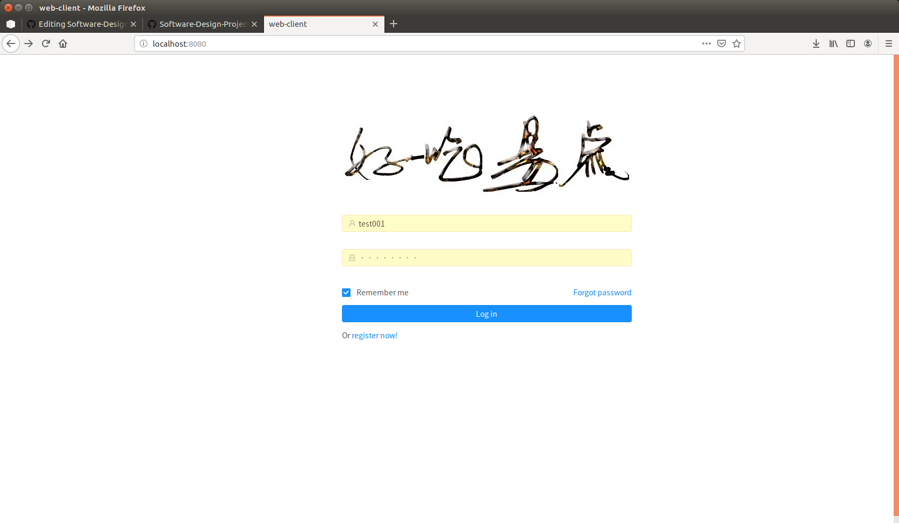  
+ 登录成功后会自动跳转到商家商品分类界面  
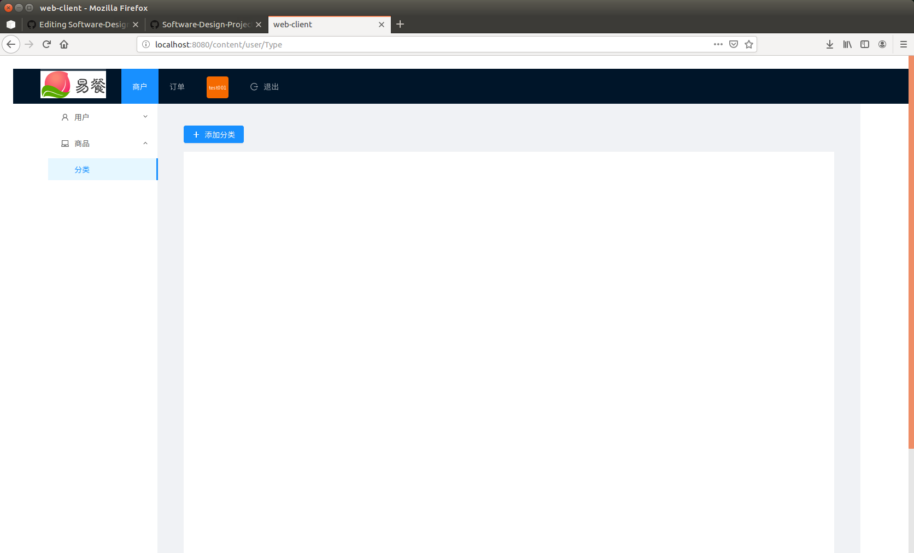  
+ 初始商品分类为空 点击添加商品分类  
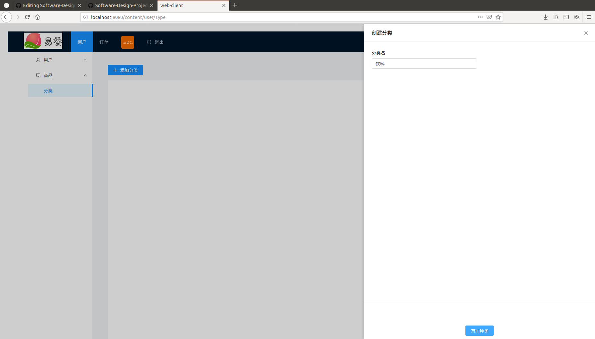 
+ 添加多个商品分类  
上线15个分类  
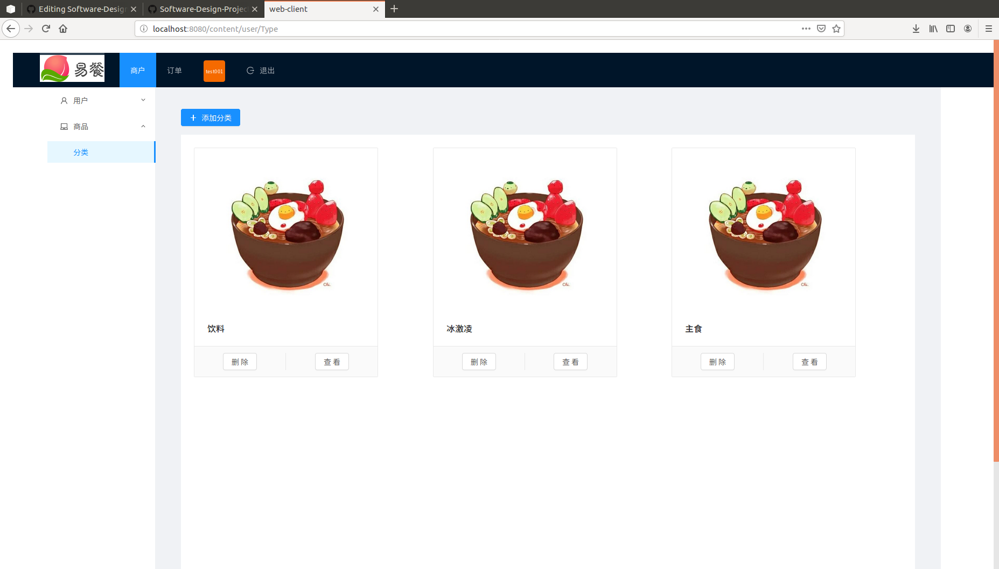  
+ “查看”商品分类进行添加商品  
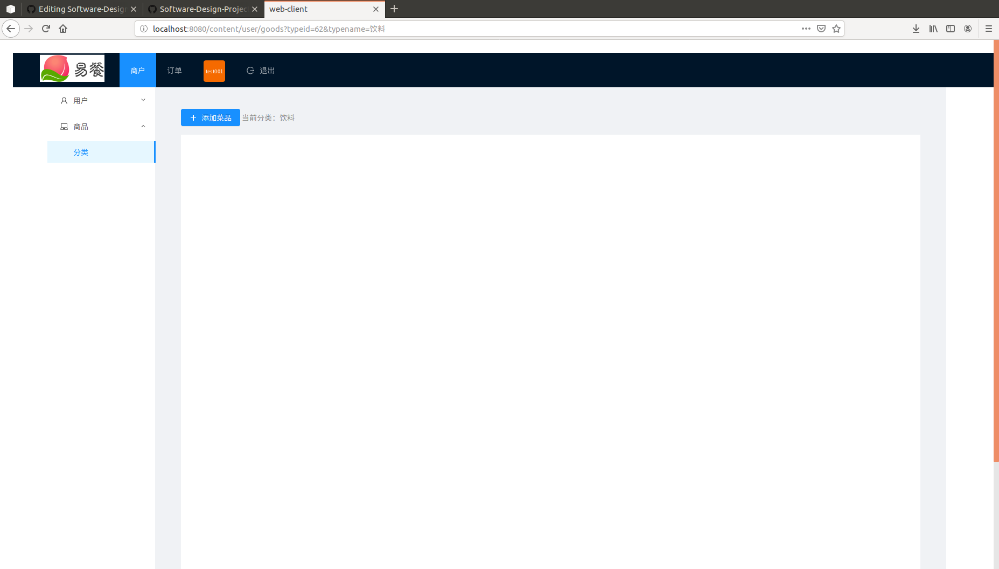 
+ 点击添加商品  
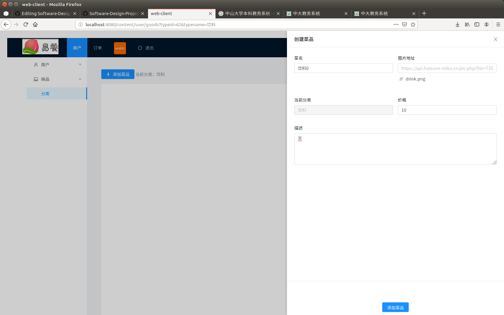 
+ 添加多个商品  
每个分类上限拥有21个商品  
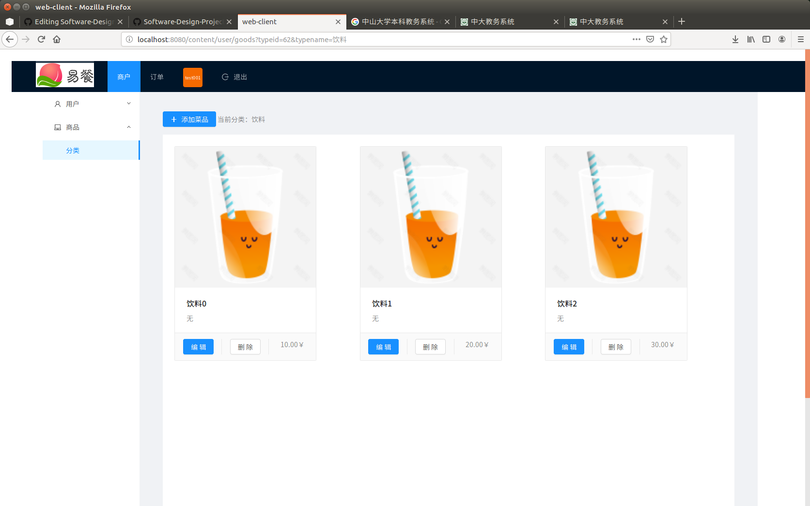 
+ 选择其他商品分类添加商品
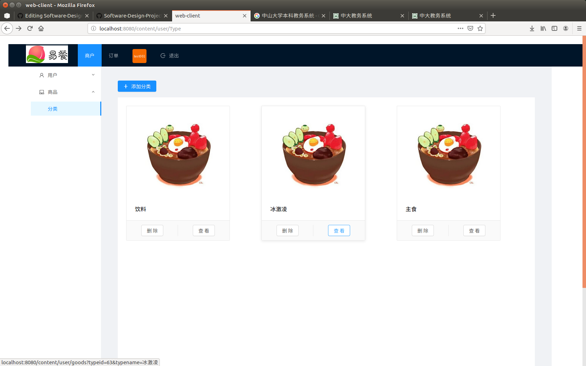 
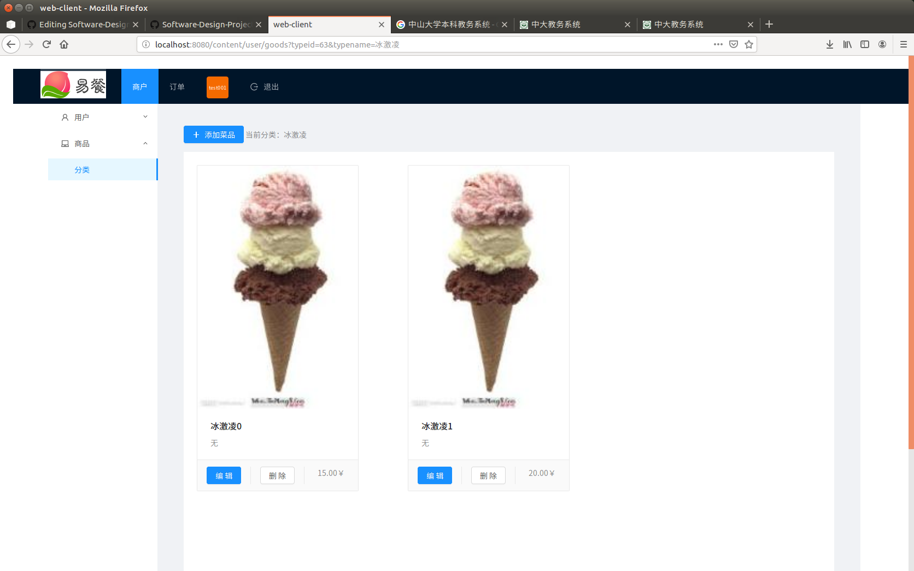 
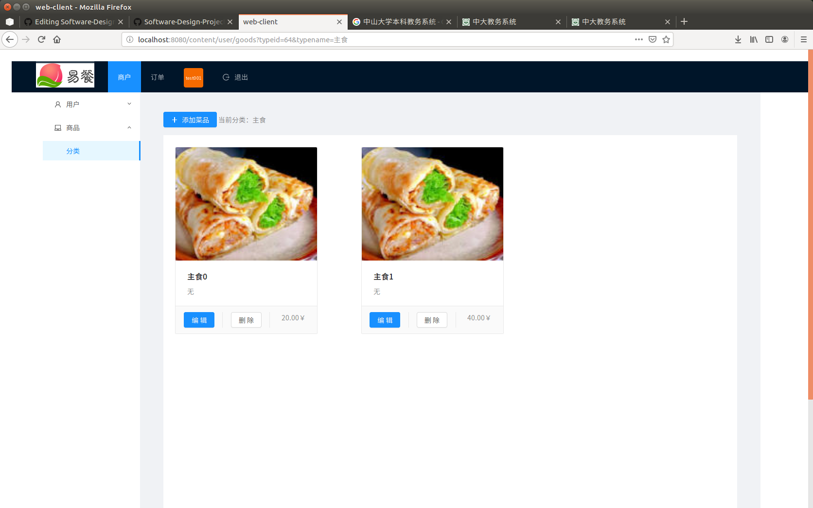 
商品分类删除，商品的删除和编辑不需要说明  
**5**.商家信息  
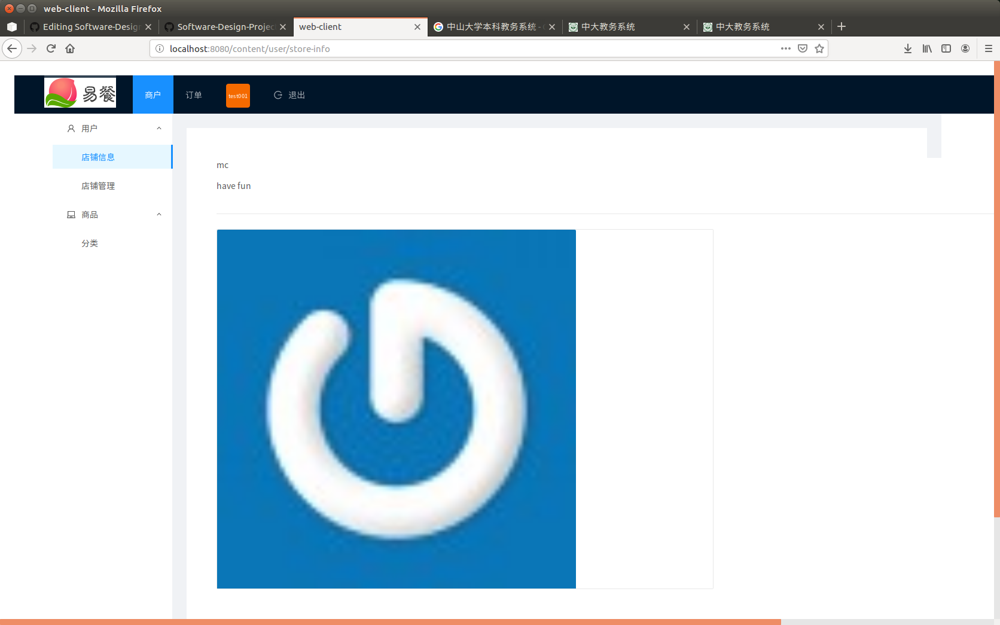 
**6**.商家管理  
+ 显示商家当天总收入和当天总订单数目  
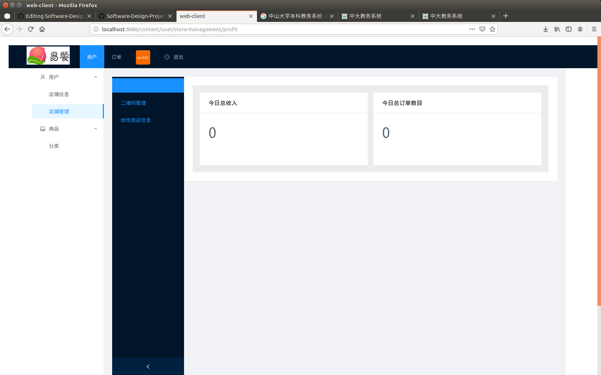 
+ 管理生成二维码，与座位号绑定  
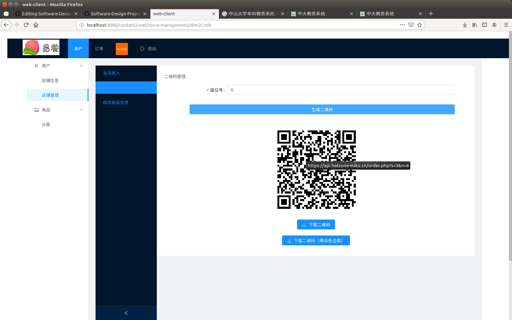 
+ 修改商店名称，商店描述，商店图标  
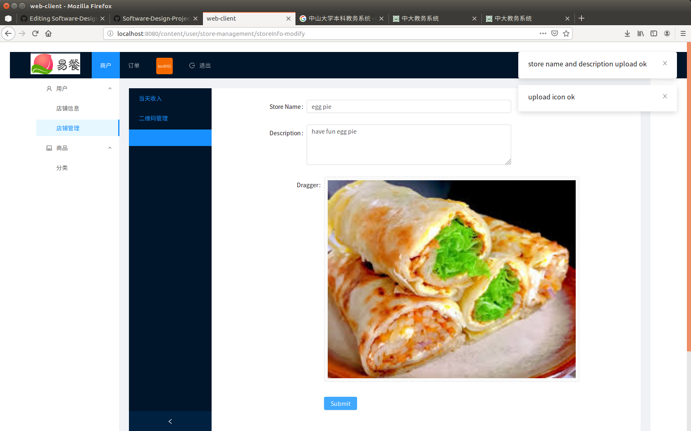 
**7**.订单   
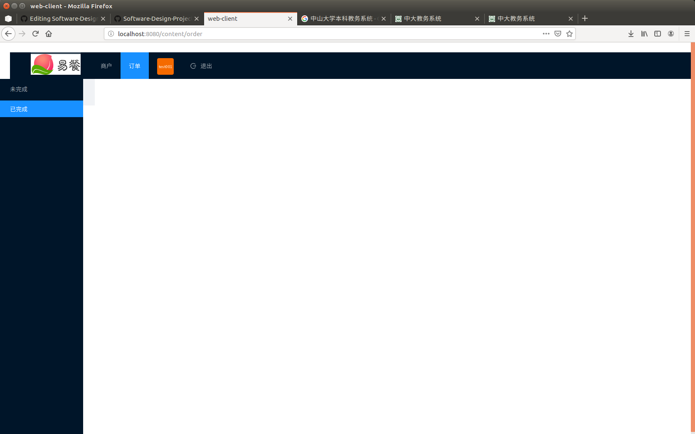 
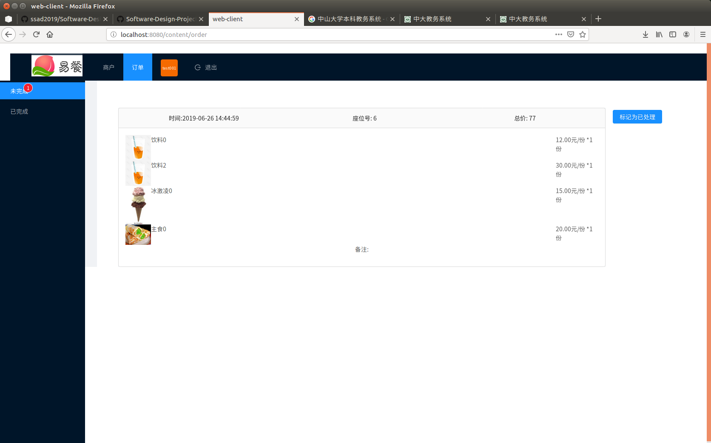 
每三秒请求一下订单信息  
