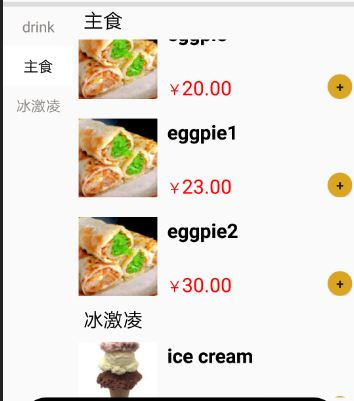
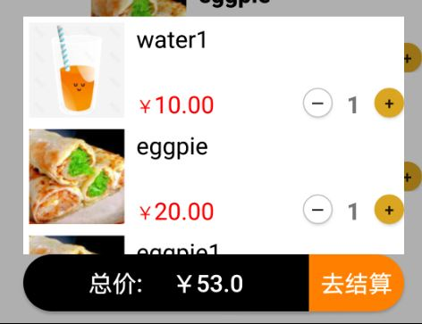
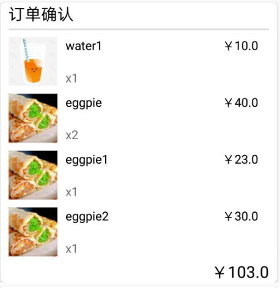
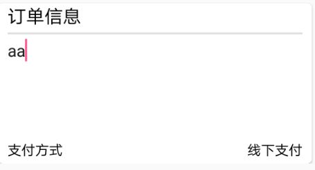
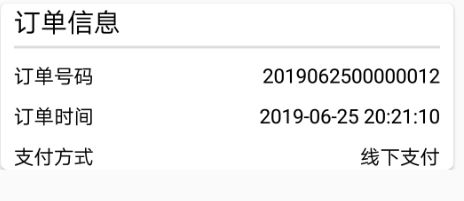

# 软件设计文档(SDS)

- [安卓端app](#1)
    - [安装](#4)
    - [技术选择理由](#5)
    - [模块划分](#6)
    - [UI设计指南](#7)
- [web前端](#2)
- [服务端](#3)

<h2 id='1'> 一、安卓端app </h2>

<h3 id='4'> 1. 安装 </h3>
用户从github下载apk并安装

<h3 id='5'> 2. 技术选择理由 </h3>

使用安卓作为客户端开发平台，主要理由有以下三点:

- 安卓端开发简洁。使用Android Studio进行安卓端开发，UI设计简洁灵活，可以使用基础控件，也可导入网络资源；逻辑书写清晰明了，控件事件处理，页面跳转，网络访问等均有相应的函数，按需调用和重写；项目部署安装步骤简单，顾客只需下载APK安装即可使用。

- 安卓端项目易于修改。在已完成项目的基础上，开发小组可以添加新的界面，新的功能，将原项目整合为新的项目的一个用例，不断丰富已有的项目工程。

- 安卓端能方便地使用网络资源。通过导入包(添加引用)的形式，开发人员可以使用同行写好的控件、工具类等实现自己的功能需求。
   
<h3 id='6'> 3. 模块划分：</h3>
此部分按照界面和功能划分安卓App为以下几个模块

- <h4 id='61'> 3.1 扫描 </h4>
    
- <h4 id='62'> 3.2 主菜单 </h4>

主菜单界面包括商家简介，菜品列表以及订单按钮。点击商家信息（图片，名字，简介）可以跳转到商家详情界面。

菜单列表顶部的标题栏显示当前列表第一个item的种类，与左边的种类列表互相关联。点击左边的菜品种类，右边的菜品列表会跳转到相应的种类；滑动右边的菜品列表，左边的菜品种类会相应地切换。可以点击按钮添加菜品到订单或者从订单中删除菜品，点击菜品列表中的项目会跳转到菜品详情界面。

底部的订单按钮分为两部分，左部分显示当前订单总价，当订单列表中有菜品项时，点击可以查看订单。右部分当订单列表中有菜品项时按下可以跳转到订单确认界面。

- <h4 id='63'> 3.3 商店详情 </h4>

商店详情界面包括商家图片，商家名称和商家简介。

- <h4 id='64'> 3.4 菜品详情 </h4>

菜品详情界面包括菜品图片，菜品名称和菜品简介。点击按钮可以添加菜品到订单或者从订单中删除菜品。底部的订单按钮与主菜单界面逻辑相同。

- <h4 id='65'> 3.5 订单确认与订单信息 </h4>

订单确认界面与订单信息界面的设计大致相同，使用多item样式ListView作为主要布局，item使用CardView进行美化。订单确认界面包括订单列表和订单备注添加两个card，订单信息界面包括订单列表和订单信息显示订单号和订单时间）两个card。

- <h4 id='66'> 3.6 网络访问 </h4>

- <h4 id='67'> 3.7 其他工具/单例类 </h4>

DensityUtil工具类，用于dp和px之间互相转换，在使用java代码设置控件宽高时使用。

StoreData单例类，用于网络加载数据的存储。

<h3 id='7'> 4. UI设计指南：</h4>
a) 友好礼貌

为了避免用户使用安卓App时，注意力被周围复杂环境干扰，App在设计时应该注意减少无关的设计元素对用户目标的干扰，礼貌地向用户展示程序提供的服务，友好地引导用户进行操作。

b) 重点突出

每个页面都应有明确的重点，以便于用户每进入一个新页面的时候都能快速地理解页面内容。在确定了重点的前提下，应尽量避免页面上出现其它与用户的决策和操作无关的干扰因素。

例如主菜单界面，从上至下的控件内容清晰明了，控件逻辑设计合理且符合用户预期。

c) 流程明确

为了让用户顺畅地使用页面，在用户进行某一个操作流程时，应避免出现用户目标流程之外的内容而打断用户。

扫码 -> 点餐 -> 确认 -> 提交；整个流程由4个界面组成，各界面之间跳转不存在流程外的事件处理，符合一般操作流程。

d) 减少等待，反馈及时

页面的过长时间的等待会引起用户的不良情绪，因此应当尽量减少用户的等待时间，通过部分UI界面的加载缓解用户的不良情绪。

由于ListView中包含的菜品图片加载需要请求网络，如果使用一次性加载的方式，从扫码界面到主界面的等待时间会非常长，因此将网络请求写入Adapter中，当需要显示图片且图片不存在的时候请求网络加载图片，并将图片保存在本地，下一次请求时直接从本地获取。另一方面，限定线程池的数量（3）避免程序卡死。
