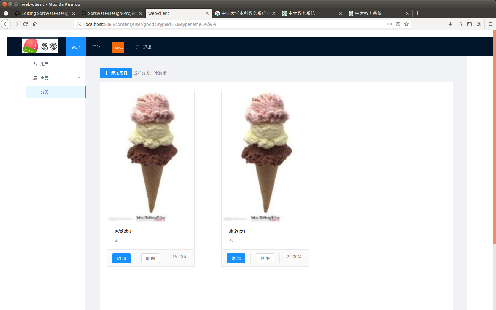
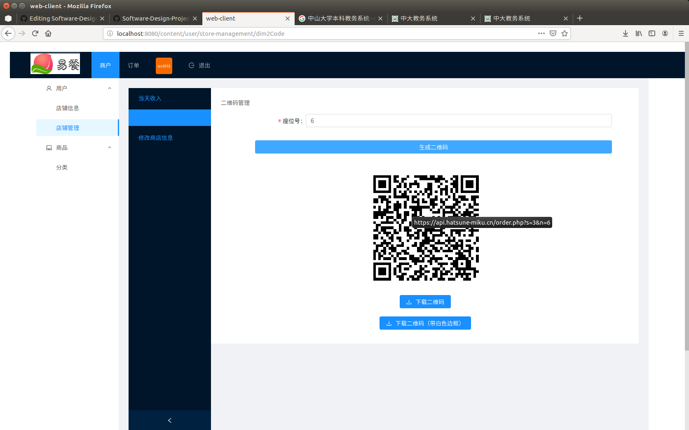
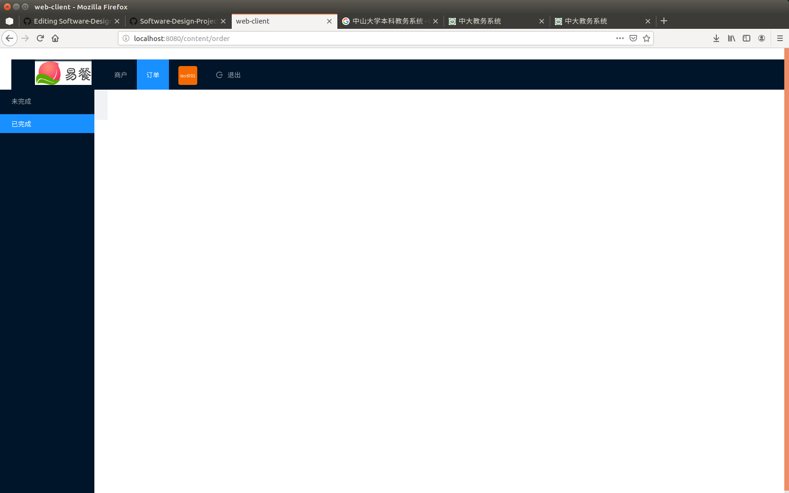

# 软件设计文档(SDS)

- [安卓端app](#1)
    - [安装](#4)
    - [技术选择理由](#5)
    - [模块划分](#6)
    - [UI设计指南](#7)
- [web前端](#2)
    - [安装](#21)
    - [技术选择理由](#22)
    - [模块划分与逻辑](#23)
    - [UI设计理念](#24)
- [服务端](#3)
    - [技术选择理由](#31)
    - [架构设计](#32)
    - [模块划分](#33)
    - [数据库设计](#34)
    - [API设计](#35)

<h2 id='1'> 一、安卓端app </h2>

<h3 id='4'> 1. 安装 </h3>
用户从github下载apk并安装

<h3 id='5'> 2. 技术选择理由 </h3>

使用安卓作为客户端开发平台，主要理由有以下三点:

- 安卓端开发简洁。使用Android Studio进行安卓端开发，UI设计简洁灵活，可以使用基础控件，也可导入网络资源；逻辑书写清晰明了，控件事件处理，页面跳转，网络访问等均有相应的函数，按需调用和重写；项目部署安装步骤简单，顾客只需下载APK安装即可使用。

- 安卓端项目易于修改。在已完成项目的基础上，开发小组可以添加新的界面，新的功能，将原项目整合为新的项目的一个用例，不断丰富已有的项目工程。

- 安卓端能方便地使用网络资源。通过导入包(添加引用)的形式，开发人员可以使用同行写好的控件、工具类等实现自己的功能需求。
   
<h3 id='6'> 3. 模块划分：</h3>
此部分按照界面和功能划分安卓App为以下几个模块

- <h4 id='61'> 3.1 二维码扫描 </h4>
    
二维码扫描页面是用户打开app后看到的第一个页面
包含标题和扫码图标，点击扫码图标开始扫码
扫码成功将跳转到点餐界面

    
- <h4 id='62'> 3.2 主菜单 </h4>

主菜单界面包括商家简介，菜品列表以及订单按钮。点击商家信息（图片，名字，简介）可以跳转到商家详情界面。


菜单列表顶部的标题栏显示当前列表第一个item的种类，与左边的种类列表互相关联。点击左边的菜品种类，右边的菜品列表会跳转到相应的种类；滑动右边的菜品列表，左边的菜品种类会相应地切换。可以点击按钮添加菜品到订单或者从订单中删除菜品，点击菜品列表中的项目会跳转到菜品详情界面。


底部的订单按钮分为两部分，左部分显示当前订单总价，当订单列表中有菜品项时，点击可以查看订单。右部分当订单列表中有菜品项时按下可以跳转到订单确认界面。


- <h4 id='63'> 3.3 商店详情 </h4>

商店详情界面包括商家图片，商家名称和商家简介。

- <h4 id='64'> 3.4 菜品详情 </h4>

菜品详情界面包括菜品图片，菜品名称和菜品简介。点击按钮可以添加菜品到订单或者从订单中删除菜品。底部的订单按钮与主菜单界面逻辑相同。


- <h4 id='65'> 3.5 订单确认与订单信息 </h4>

订单确认界面与订单信息界面的设计大致相同，使用多item样式ListView作为主要布局，item使用CardView进行美化。订单确认界面包括订单列表和订单备注添加两个card，订单信息界面包括订单列表和订单信息显示订单号和订单时间）两个card。


- <h4 id='66'> 3.6 网络访问 </h4>

- <h4 id='67'> 3.7 其他工具/单例类 </h4>

DensityUtil工具类，用于dp和px之间互相转换，在使用java代码设置控件宽高时使用。

StoreData单例类，用于网络加载数据的存储。

<h3 id='7'> 4. UI设计指南：</h3>
a) 友好礼貌

为了避免用户使用安卓App时，注意力被周围复杂环境干扰，App在设计时应该注意减少无关的设计元素对用户目标的干扰，礼貌地向用户展示程序提供的服务，友好地引导用户进行操作。

b) 重点突出

每个页面都应有明确的重点，以便于用户每进入一个新页面的时候都能快速地理解页面内容。在确定了重点的前提下，应尽量避免页面上出现其它与用户的决策和操作无关的干扰因素。

例如主菜单界面，从上至下的控件内容清晰明了，控件逻辑设计合理且符合用户预期。


c) 流程明确

为了让用户顺畅地使用页面，在用户进行某一个操作流程时，应避免出现用户目标流程之外的内容而打断用户。

扫码 -> 点餐 -> 确认 -> 提交；整个流程由4个界面组成，各界面之间跳转不存在流程外的事件处理，符合一般操作流程。

d) 减少等待，反馈及时

页面的过长时间的等待会引起用户的不良情绪，因此应当尽量减少用户的等待时间，通过部分UI界面的加载缓解用户的不良情绪。

由于ListView中包含的菜品图片加载需要请求网络，如果使用一次性加载的方式，从扫码界面到主界面的等待时间会非常长，因此将网络请求写入Adapter中，当需要显示图片且图片不存在的时候请求网络加载图片，并将图片保存在本地，下一次请求时直接从本地获取。另一方面，限定线程池的数量（3）避免程序卡死。

<h2 id='2'> 二、WEB前端</h2>

<h3 id='21'> 1.安装</h3>
[按照部署文档进行部署:https://github.com/ssad2019/Software-Design-Projects/blob/master/安装部署文档.md](https://github.com/ssad2019/Software-Design-Projects/blob/master/%E5%AE%89%E8%A3%85%E9%83%A8%E7%BD%B2%E8%AF%B4%E6%98%8E.md)

<h3 id='22'>2.技术选择理由</h3>

 - 前端开发参照MVVM体系选择了vue架构，在ui设计上选择了antvue模板。
    - 在ui设计中为了节省开发时间和界面美观，使用了阿里公司开发的Ant-Vue模板
    - Vue与服务器后端对接中按照不同界面不同数据量的情况，分别使用了xmlrequest和Axios两种技术
    - 使用js作为网页后端的技术支持，js简单且容易理解，并且满足了所有的操作需求
    - Vue作为一种以模板为主要优势的架构，在协同开发时具有很高的便利性和整合性。Vue的模板将代码复用和模块化编辑提高到最大化，减少了代码的体积和开发的困难。
    - webpack的挂载技术，即Vue动态挂载模块，为动态生成和数据绑定，重复数据操作提供了完美的支持。虽然因为了解的不够导致不够完美，但这并不影响技术的强大功能。
    - 在跳转方面使用了路由和本地重载，强制跳转三种方式。为了满足不同情况下的数据需求
    - 开发环境不多做描述，Vue支持多平台开发。浏览器推荐使用chrome与Edge。方便进行测试和debug
	
<h3 id='23'>3.模块划分与逻辑</h3>

- 模块划分
    - 按照功能进行划分
        - 登录模块：进行登陆验证身份，根据不同的用户进入不同的用户界面
        - 注册模块：注册新用户，创建新的商户
        - 商店信息模块：显示商家的基本信息，并生成独立的商家二维码供顾客安卓端使用
        - 商家信息编辑模块：对商家的信息进行修改，对营收进行核对
        - 商品分类模块：显示商家当前拥有的分类进行显示，增加删除分类，点击进入该分类商品界面
        - 商品模块：显示该分类下所有的商品，可进行增加删除和修改商品。除所属分类外都可进行修改，商品信息包括商品名称、价格、图片、简介、分类，添加商品将会自动添加到当前分类下
        - 图片上传模块：包括在商家信息修改和商品信息添加与修改
        - 导航菜单模块：模块跳转与退出登录功能
        - 订单模块：对顾客安卓端提交的订单进行查看和状态管理。状态分为处理中和已完成，已完成订单将放置到另一分类。
        - 二维码模块：将商家信息与座位号生成至二维码链接，客户可进行扫描进入商家进行点餐
    - 模块运作逻辑
        - 用户在注册成功后可使用账户登录
        - 
        - 
        - 登录成功后显示当前商家商品分类模块，可进行增删操作
        - 
        - 点击分类模块中各分类的动态生成模块跳转至所点击分类（商品模块）
        - 
        - 加载商品模块，可进行商品的增删修改操作
        - 
        - 根据导航菜单可进行跳转至其他模块，包含以下四个模块
            - 商家信息模块
            - 
            - 商家信息编辑模块
            - 
            - 二维码模块
            - 
            - 订单模块
            - 
        - 订单模块中根据数据请求获得订单，处理订单状态
        - 
        - 以上操作均与数据库同步，进行请求和获取操作，同步数据状态
		
<h3 id='24'> 4.UI设计理念</h3>
UI设计的目的在于建立简单、一致、高效、医用、友好的用户使用体验。
设计原则主要有以下几点：

- 简易性。设计简洁的界面，令用户便于了解并使用产品，减少用户发生错误操作的可能性。

- 一致性。界面的结构、风格需要保持一致。具体到图标的大小、颜色，字体的类型和大小等。

- 从用户习惯考虑。从用户的角度出发，想用户所想，做用户所做。界面应当符合一般用户的使用习惯。

- 导航明确。导航放置在明确的位置，确保用户在使用不同功能的时候不会迷路，清楚自己正在使用哪个功能，并知道其他功能如何跳转、使用。

- 流程清晰。避免出现用户目标流程之外的内容打断流程，并给予适当的使用引导令用户成功完成整套流程。

- 操作反馈适当。在用户进行操作后，给予适当的操作反馈，强化用户的操作感、减轻记忆负担。

<h2 id='3'> 三、后端 </h2>

<h3 id='31'> 1.技术选择理由 </h3>

- 后端开发选择的LNMP架构，即Linux系统下Nginx+MySQL+PHP这种网站服务器架构。
    - Linux系统自不必多说，是目前最流行的免费操作系统，而且刚好小组成员里有一个现成的阿里云的Linux虚拟机；
    - Nginx作为Web服务器，相比于Apache，它使用更少的资源并支持更多的并发连接，效率更高而且运维简单；
    - Mysql则是之前上数据库课的时候就已经熟悉了，开发当然是尽量选择熟悉的东西；
    - PHP作为在服务器端执行的脚本语言，语法简单，比较容易上手，而且不用写路由，取HTTP传参比Node.js又方便一些，还适合规模比较小的开发；
    - 最后就是后端部署选用的是一个第三方的自动化环境框架OneinStack，在它的官网可以通过自动安装来在服务器上简单部署LNMP架构。

<h3 id='32'> 2.架构设计 </h3>

<h4 id='321'> 应用程序目录 </h4>  


- 后端程序架构类似MVC，即分成了模型(model)，视图(view)，控制器(controller)
    - 上图目录中的settings文件夹即是model，或者说是连接model的配置文件，后端通过settings对数据库进行增删改查的操作
    - 上图目录中的app文件夹即是view，它负责的是对外的接口，解析网络请求并将请求转给include文件夹中对应的处理单元
    - 上图目录中的include文件夹即是controller，它负责控制网络请求通过API和服务器数据库的交互

<h4 id='321'> 逻辑视图 </h4>


<h3 id='33'> 3.模块划分 </h3>

服务端的模块划分大体上分为登录/注册，处理商家请求模块和处理客户请求模块

- 登录/注册模块(商家进行登录/注册账户，成功则录入数据库并返回一个token用于后续验证商家身份)
- 处理商家请求模块，又细分为商家信息模块，订单信息模块和菜单信息模块(该模块中的API都需要鉴权，用于后续商家管理自身信息，自家菜单和订单信息的身份验证)
    - 商家信息模块(用于设置商家图标，获取商家信息，更改商家信息和生成点餐链接)
    - 订单信息模块(用于获取订单列表，订单详细信息和设置订单状态)
    - 菜单信息模块(用于用于获取分类和菜品列表并对其进行增删改的操作)
- 处理客户请求模块，又细分为拉取菜单模块和生成订单模块(仅接受自身开发的安卓APP的请求)
    - 拉取菜单模块(用来拉取对应商家的菜单信息)
    - 生成订单模块(用于将用户的订单信息存入数据库)

<h3 id='34'> 4.数据库设计 </h3>


- user
```
CREATE TABLE IF NOT EXISTS user (
        id INTEGER AUTO_INCREMENT PRIMARY KEY,
        username VARCHAR(32) UNIQUE NOT NULL,
        passwd VARCHAR(255) NOT NULL,
        nickname VARCHAR(255) DEFAULT \'\',
        description VARCHAR(255) DEFAULT \'\',
        avatar VARCHAR(255) DEFAULT \'\'
    ) DEFAULT CHARSET = utf8
```

- type
```
CREATE TABLE IF NOT EXISTS type (
        id INTEGER AUTO_INCREMENT PRIMARY KEY,
        userid INTEGER NOT NULL,
        typename VARCHAR(32) NOT NULL,
        CONSTRAINT t_u_fk FOREIGN KEY (userid) REFERENCES user (id) ON UPDATE CASCADE ON DELETE CASCADE
    ) DEFAULT CHARSET = utf8
```

- menu
```
CREATE TABLE IF NOT EXISTS menu (
        id INTEGER AUTO_INCREMENT PRIMARY KEY,
        userid INTEGER NOT NULL,
        typeid INTEGER NOT NULL,
        foodname VARCHAR(32) NOT NULL,
        price DECIMAL(8,2) NOT NULL,
        description VARCHAR(255) DEFAULT \'\',
        imgurl VARCHAR(255) DEFAULT \'\',
        CONSTRAINT m_u_fk1 FOREIGN KEY (userid) REFERENCES user (id) ON UPDATE CASCADE ON DELETE CASCADE,
        CONSTRAINT m_t_fk2 FOREIGN KEY (typeid) REFERENCES type (id) ON UPDATE CASCADE ON DELETE CASCADE
    ) DEFAULT CHARSET = utf8
```

- list
```
CREATE TABLE IF NOT EXISTS list (
        id INTEGER AUTO_INCREMENT PRIMARY KEY,
        userid INTEGER NOT NULL,
        site INTEGER NOT NULL,
        ordertime Datetime NOT NULL,
        status Boolean NOT NULL DEFAULT false,
        info Text NOT NULL,
        remark VARCHAR(255) DEFAULT \'\',
        CONSTRAINT o_u_fk FOREIGN KEY (userid) REFERENCES user (id) ON UPDATE CASCADE ON DELETE CASCADE
    ) DEFAULT CHARSET = utf8
```

<h3 id='35'> 5.API设计 </h3>
[API设计相关请点击跳转](https://github.com/ssad2019/Web-Server-Side/blob/master/Document(API).md)
